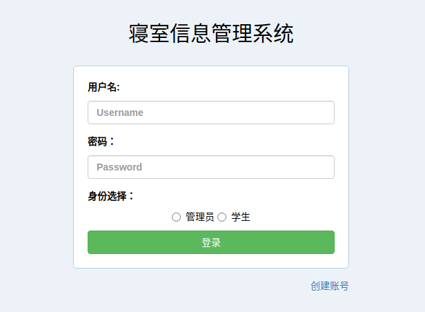
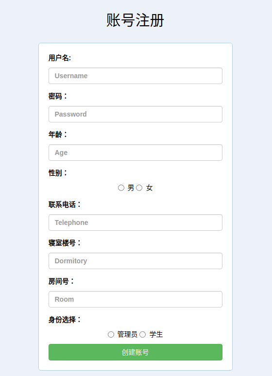
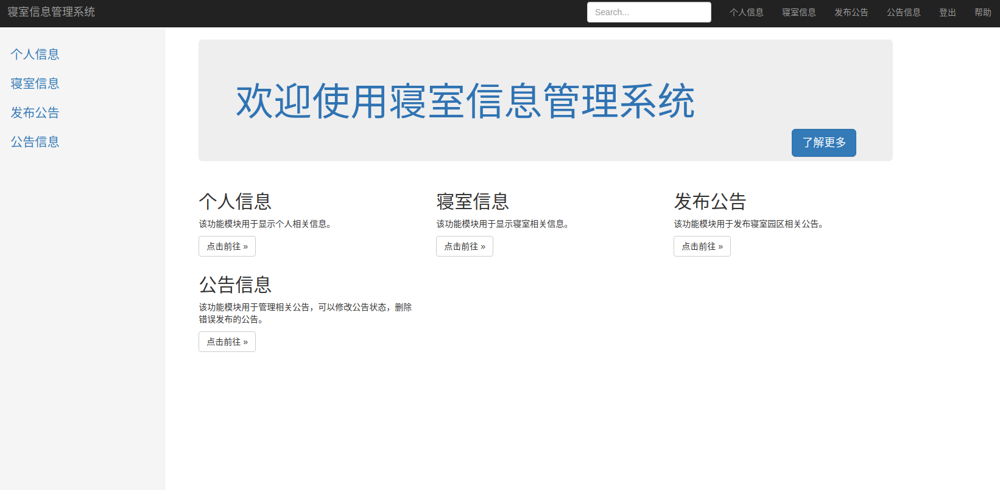
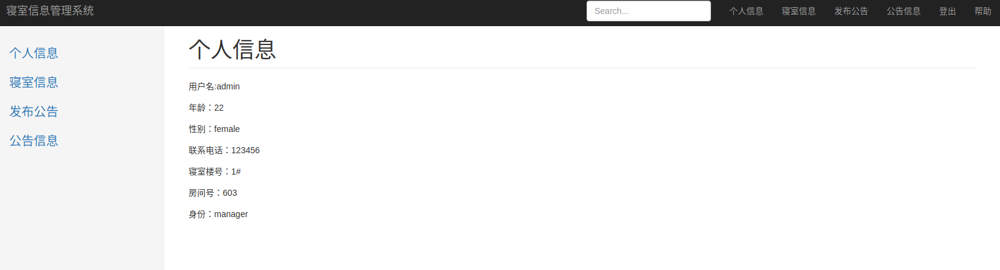
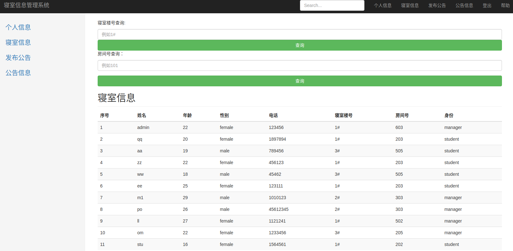
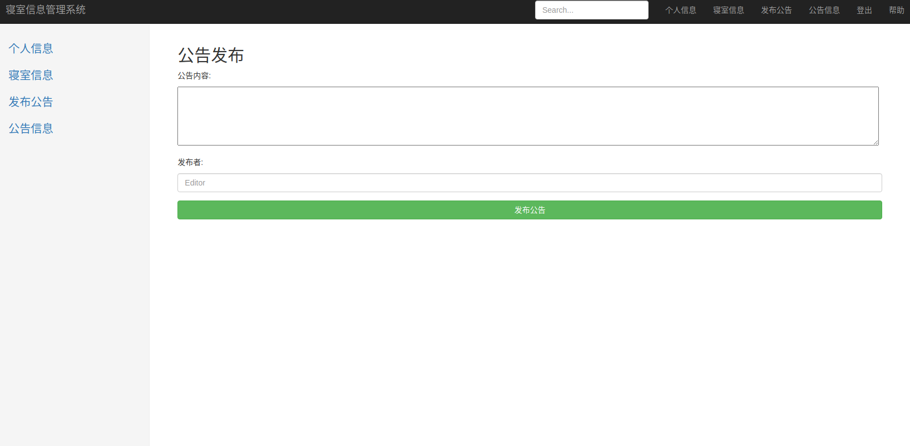
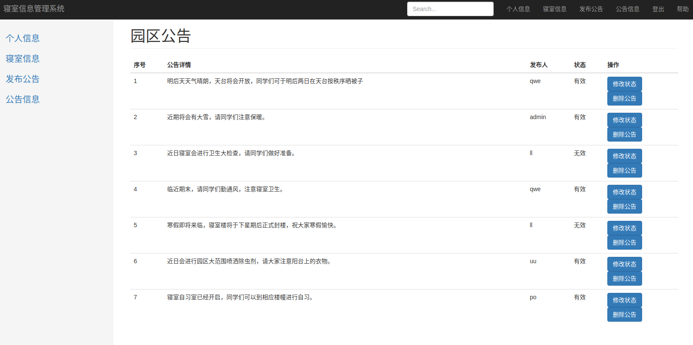
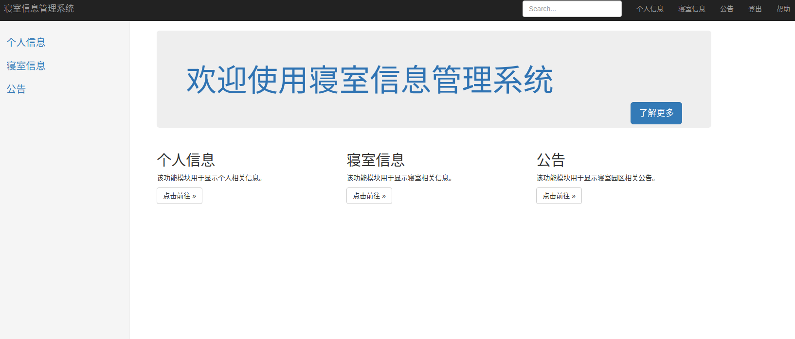
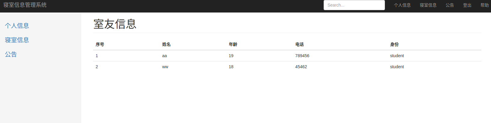
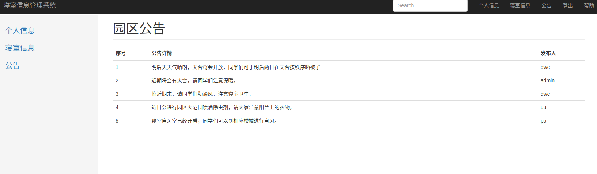

# 寝室信息管理系统

### 1、项目设计部分

1）项目总体构成

作为一个寝室信息管理系统，主要分管理员与学生两种不同的身份，包括登录注册、登出、查看个人信息等基本功能。管理员可以查看所有寝室信息，可通过寝室楼幢号或房间号进行人员信息查询，同时可以发布公告，并对已经发布的公告进行管理，例如修改公告状态来决定是否在学生页面显示，也可以删除无效或错误发布的公告。学生可以查看个人信息以及与自己同一寝室的人员信息，和还可以查看寝室公告。

2）引入的包在项目中的作用相关说明

在本项目中导入express、mongoose、ejs、bootstrap等包，其中express是一个轻量级且灵活的框架，可快速构建web服务器 / api服务器；mongoose是nodejs中提供操作mongodb的模型，能够通过node语法实现mongodb数据库增删改查，从而实现用nodejs写程序来管理mongodb数据库；ejs可以把我们数据库和文件读取的数据显示到 Html 页面上面；bootstrap 是最受欢迎的 HTML、CSS 和 JS 框架，用于开发响应式布局、移动设备优先的 WEB 项目。

3）项目目录结构和各个部分的说明

（1）项目目录结构

（2）项目各个部分说明

### 2、使用说明书

1）用户登录注册、登出

（1）登录：输入用户名、密码及身份，在数据库中进行信息查询、核对，若信息无误则跳转至相应的home界面，错误则会提示“用户名、密码或身份选择错误，请重新登录“，如果信息填写不完整则会提示“请完整输入信息后再点击登录“。

（2）注册：在登录界面点击“创建账号”来进行用户注册，在表中输入对应信息后点击“创建账号“，跳转至home界面，用户信息会添加到数据库中。若必填信息未填写会提示“请输入必填信息后再点击注册“。

（3）登出：在用户登录后，可以通过点击导航栏中右上角“登出”来退出，回到登录界面。

2）管理员模块（以用户admin为例）

（1）个人信息：通过查询数据库，显示注册时填写的相关个人信息。

（2）寝室信息：通过查询数据库，显示所有用户的寝室信息；也可输入寝室楼号或者房间号进行寝室信息查询，在无输入时查询则会显示全部信息。

（3）发布公告：管理员输入公告内容及发布者信息，点击“发布公告”，公告相关信息会添加到数据库中，并提示“公告发布成功“；若信息填写不完整则会要求填写完整后再进行发布。

（4）公告信息：显示在数据库中的所有公告信息，管理员可以通过“修改状态“按钮对公告的状态进行修改，按下按钮会在数据库中修改对应信息，公告状态“有效“时会在学生公告页面进行显示，否则不显示；“删除公告“是在数据库中删除该条记录，点击后页面中也不再显示该条公告。

3）学生模块（以用户aa为例）

（1）个人信息：通过查询数据库，显示注册时填写的相关个人信息。

（2）寝室信息：通过查询数据库，显示与自己同一个寝室的用户信息。

（3）公告：通过查询数据库，显示状态为有效的公告信息。

### 3、开发日记

2021.10.5 ： Test remote

2021.12.8 ： Add a file:index.html

​					Install express successfully

​					install mongoose successfully

2021.12.12 ： mongodb success form web.

​					ejs is basically successful

2021.12.17 ： install bootstrap and jquery successfully

​					add login and reg files

